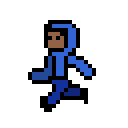
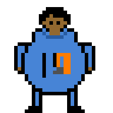

Buttons to pages: <br>


<div style="display: flex; flex-wrap: wrap; gap: 10px;">
    <a href="{{site.baseurl}}/fthing" style="text-decoration: none;">
        <div style="background-color:rgb(137, 137, 137); color: black; padding: 10px 20px; border-radius: 5px; font-weight: bold;">
            Tinkers
        </div>
     </a>
</div>

<br>


<div style="display: flex; flex-wrap: wrap; gap: 10px;">
    <a href="{{site.baseurl}}/fthing" style="text-decoration: none;">
        <div style="background-color:rgb(137, 137, 137); color: black; padding: 10px 20px; border-radius: 5px; font-weight: bold;">
            Five Things We Did
        </div>
     </a>
</div>

<br>

<div style="display: flex; flex-wrap: wrap; gap: 10px;">
    <a href="{{site.baseurl}}/tuw" style="text-decoration: none;">
        <div style="background-color:rgb(137, 137, 137); color: black; padding: 10px 20px; border-radius: 5px; font-weight: bold;">
            Tinkers Write Up
        </div>
     </a>
</div>

<br>

<div style="display: flex; flex-wrap: wrap; gap: 10px;">
    <a href="{{site.baseurl}}/tuw" style="text-decoration: none;">
        <div style="background-color:rgb(137, 137, 137); color: black; padding: 10px 20px; border-radius: 5px; font-weight: bold;">
            N@TM Feedback
        </div>
     </a>
</div>

<br>


<!--


---
layout: base
title: Game Planning
description: Planning for CSSE RPG
hide: true
---


<br>
Our game idea is a platformer RPG and has the  of Arrav LaJolla and Ruhann Balsa. <br>
Arrav is the main character and Ruhann is the secondary character. <br>
We would have a collision action command in order to tell if Arrav hits Ruhann <br>
If Arrav hits Ruhann, Arrav instantly dies, and the game ends in a loss. <br>
If possible, we would also use the collision action command to add projectiles into the game, and if Arrav hits Ruhann with a projectile then this would result in either Ruhann losing health or Ruhann being slowed down or hit off the platform he currently is on.


We have sprites of Arrav and Ruhann

# Varra

<br>
Arrav is the protagonist of our game and is what the player (you) will control. 

# Nnahur

<br>
Ruhann is the main antagonist of our game and you are trying to defeat him with your platforming skills. 


### WE GOT PERMISSION FROM RUHAAN AND AARAV TO DEPICT THEM IN THIS WAY.


# Goal of the game
In order to win our game, you trying to finish the end of the platform before Ruhann does. This is used with your parkour skills and you are controlling the Arrav with the arrow keys <br>
The game can be visualized as the online multiplayer game Tag, except that instead of trying to tag the other player, you are trying to get ahead of Ruhann <br>


# Flowchart <br>

Zhengji and Advait flowchart for CSSE Game: <br>

<br>


General Code for the game
our game would usually utilize the this.physics command <br>
we would use it like such

```
let arrav = this.physics.add.sprite(100, 300, 'arrav');
```

we would also like to not allow collision between Arrav and Ruhann, utilizing the 
```
interactionAction
isColission()
```

<br>
We would also use code like the following for our background

```
function draw(ctx) {
    ctx.fillStyle = "blue";
    ctx.fillRect(10, 10, 100, 100);
}
```


<br>
<br>
<br>
<br>
<br>
<br>
<br>
<br>
<br>
<br>
<br>
<br>
<br>
<br>
<br>
<br>
<br>
<br>
<br>
<br>
<br>
<br>
<br>


this is making me think of the song Role Playing Game by soramafuurasaka lol
-->


<!-- 
it worked...

thank you finally....

now its time to local host...

local host, has worked...

YESSSSSSS

THAT

WAS

SO

NICE

FINALLY

Hi guys :D
I have been told to do more index.md stuff so here have some gibberish

rip rachits friend :c

anyway have rachits github and belows his entire linkedin :D

i need to update ss but heres his linkedin link

So my buttons weere kinda not working so i inputted it into chatpgt and this is what they said to do.


<!DOCTYPE html>
<html lang="en">
<head>
  <meta charset="UTF-8">
  <meta name="viewport" content="width=device-width, initial-scale=1.0">
  <title>Buttons</title>
  <style>
    .button {
      display: inline-block;
      margin: 10px 0;
      text-decoration: none;
    }
    .button button {
      padding: 10px 20px;
      font-size: 16px;
      background-color: #007BFF;
      color: white;
      border: none;
      cursor: pointer;
      border-radius: 5px;
    }
    .button button:hover {
      background-color: #0056b3;
    }
  </style>
</head>
<body>
  <a href="https://github.com/xinjiav2/test2/blob/main/_notebooks/Foundation/B-tools_and_equipment/2023-08-22-devops_tools-verify.ipynb" target="_blank" class="button">
    <button>Validate notebook i think?</button>
  </a>

  <a href="https://www.linkedin.com/in/rachit-jaiswal-a534b5196" target="_blank" class="button">
    <button>Rachit's LinkedIn</button>
  </a>

  <a href="https://github.com/rachit-j" target="_blank" class="button">
    <button>Rachit's GitHub</button>
  </a>

  <a href="https://academicsandathleticsforall.org/team" target="_blank" class="button">
    <button>Rachit's Non-Profit</button>
  </a>

  <a href="https://ftcscorpio.com/2022-2023-members/" target="_blank" class="button">
    <button>Rachit's FTC Team Scorpio</button>
  </a>

  <p>In case you have not noticed, I am kinda addicted to anything Rachit related.</p>

  <p>Anyway, I got the signup to LinkedIn thing, so I cannot put the images of Rachit on there, sadly.</p>

  <a href="https://nighthawkcoders.github.io/portfolio_2025/devops/tools/verify" target="_blank" class="button">
    <button>Verify Tools (bc apparently we need it)</button>
  </a>
</body>
</html>

hi!
apparently i got permission to have rachit images
so im gonna add that eventually

hopefully this is a snake 

<div style="display: flex; flex-wrap: wrap; gap: 10px;">
    <a href="{{site.baseurl}}/snake" style="text-decoration: none;">
        <div style="background-color: #BBDE22; color: black; padding: 10px 20px; border-radius: 5px; font-weight: bold;">
            Snake Game
        </div>
     </a>
</div>

<br>

<div style="display: flex; flex-wrap: wrap; gap: 10px;">
    <a href="{{site.baseurl}}/problemos" style="text-decoration: none;">
        <div style="background-color: #38afad; color: black; padding: 10px 20px; border-radius: 5px; font-weight: bold;">
            Problemos
        </div>
     </a>
</div>

<br>


<div style="display: flex; flex-wrap: wrap; gap: 10px;">
    <a href="{{site.baseurl}}/sxc" style="text-decoration: none;">
        <div style="background-color: #38afad; color: black; padding: 10px 20px; border-radius: 5px; font-weight: bold;">
            panel thing
        </div>
     </a>
</div>

<br>

<div style="display: flex; flex-wrap: wrap; gap: 10px;">
    <a href="{{site.baseurl}}/ntps" style="text-decoration: none;">
        <div style="background-color: #38afad; color: black; padding: 10px 20px; border-radius: 5px; font-weight: bold;">
            Code That You Get if You Press ctrl+u on Chrome New Tab (doesent work lol its just the code and you cant even see it)
        </div>
     </a>
</div>

<br>


<a href="/ithw.html">View Notebook</a>


-->