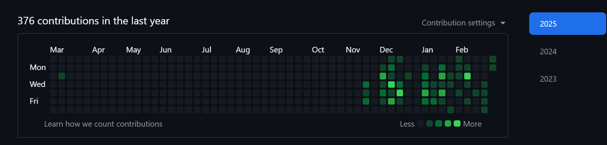

## Hi!   There are 5 things that we did throughout the trimester.
 

 
Key Thing #1
Github Analytics:  
Zhengji:  
   
Advait:  
   

Key Thing #2:  
One of the first skills we learn is how to navigate github. We have learned many basic things that us right now might think that it is too easy. We learned how to create repositories, fork repositories, use VS Code, and other things we needed to succeed. We navigated through github and got ourselves conmfortable with the system.  

Key Thing #3:  
Our third key thing was teaching arrays to our classmates. Teaching arrays has helped us understand arrays better, and by teaching this we have developed teaching skills, which would be useful for many things, such as tutoring or perhaps even teaching in CSA

Key Thing #4:  
Our fourth key thing was how we learned consistency. This class is the closest one to a real job. Each person is assigned a task to do, and they would do it on their own. Then, at the end of a certian time period, they would be taken in to do review. Or thats how my dad at Qualcomm says how its done :/ But anyway, Qualcomm is a software/hardware?? (Its hardware right?) company, and this is a software class. This skill has helped us develop skills, especially if we would like to pursue a career in Software/Hardware.  

Key Thing #5:  
Our fifth key thing was developing the skills to talk to higher ups, as well as making actual meaningful remarks in slack/discord. Our group has a group chat in both Slack and Discord, and Rachit is in both of them. If you actually like checked (directed to Rachit) both, you would have definetly have noticed how our converation changes. I have dm'ed Mr. Mort multipule times throughout the trimester, and since he does control my grade, it is best to be formal. Learning how to be formal in text messages and learning how to be formal in email is different, and since Qualcomm uses Microsoft Teams, this skill - communication, is one of the greatest skills we have learned throughout the trimester.