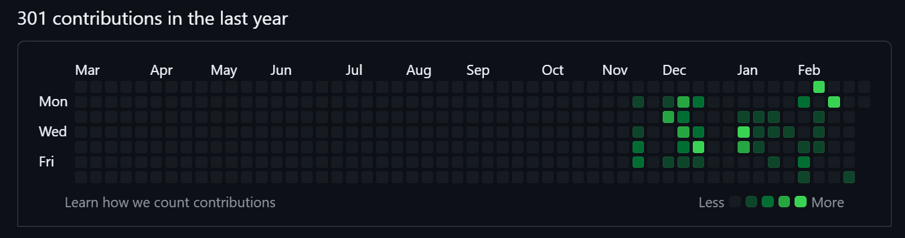

## Hi! <br> There are 5 things that we did throughout the trimester.
<br>


<br>
Key Thing #1
Github Analytics: <br>
Zhengji: <br>
  <br>
Advait: <br>
  <br>


Key Thing #2: <br>
One of the first skills we learn is how to navigate github. We have learned many basic things that us right now might think that it is too easy. We learned how to create repositories, fork repositories, use VS Code, and other things we needed to succeed. We navigated through github and got ourselves conmfortable with the system. <br>

Key Thing #3: <br>
Our third key thing was 


```


