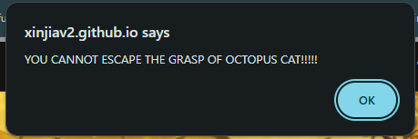

### Zhengji Li Tinkers

 - Tinker One:  
 For tinker one, I have decided to add a bit of randomness to my code, and used the math.floor() function and math.random() function to randomally generate three lines of text that would appear when you touch the mutant octopus sprite  
 
  
 Voice Line One:  
    
 Voice Line Two:  
    
 Voice Line Three:  
    

Please note: this was the orignal voice lines, where the OCTOCAT was the main enemey. Since then, The octocat has been replaced by a orignal character and his voice lines has changed, but the same mechanism is still present

 - Tinker Two:  
 Tinker Two was orignally a mistake. At the very start of the game project, when we were split into pairs of two, me and my partner; Advait Deshpande orignally planned to create a platformer RPG, where the main character Aarav Lohyia had to defeat his mortal enemey Ruhann Bansal to take his burrito back. However this idea was quickly shut down by Mort, mostly due to it shaming on Aarav and Ruhann, and that it might affect the overall game engine. However, by this time we had already finished the game, and even though the people of CSSE cannot enjoy this game, it has been a huge help in the development of our JavaScript skills and overall confidence in programming.  
 

 - Tinker Three:  
Tinker Three, was when I added background music to our game. Orignally we were planning to use the bossfight file, used in the platformer game in tinker two. However that file was on my desktop pc and was not on my laptop so I could not add it. Thus I just added another .mp3 file on there, so there would still be a form of background music in the code, even if it was some random song that nobody in this school would enjoy.  
 

### Advait Deshpande Tinkers

 ### Flowchart Of Game

   
flowchart !

