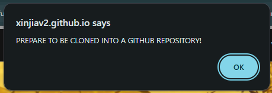
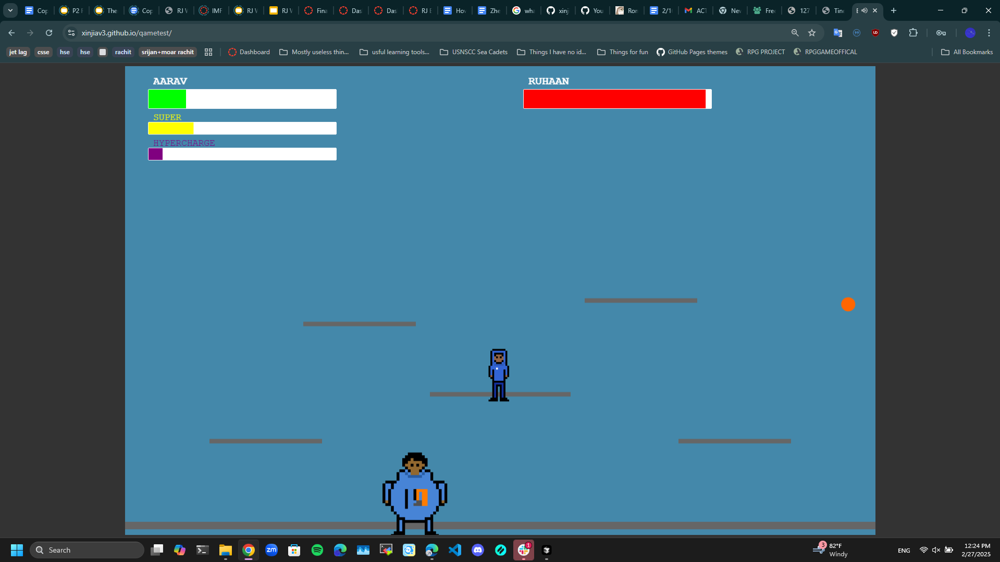

 

### Tinkers

 - Tinker One:
 For tinker one, I have decided to add a bit of randomness to my code, and used the math.floor() function and math.random() function to randomally generate three lines of text that would appear when you touch the mutant octopus sprite  
 
  
 Voice Line One:
    
 Voice Line Two:
  
 Voice Line Three:
  

Please note: this was the orignal voice lines, where the OCTOCAT was the main enemey. Since then, The octocat has been replaced by a orignal character and his voice lines has changed, but the same mechanism is still present

 - Tinker Two
 Tinker Two was orignally a mistake. At the very start of the game project, when we were split into pairs of two, me and my partner; Advait Deshpande orignally planned to create a platformer RPG, where the main character Aarav Lohyia had to defeat his mortal enemey Ruhann Bansal to take his burrito back. However this idea was quickly shut down by Mort, mostly due to it shaming on Aarav and Ruhann, and that it might affect the overall game engine. However, by this time we had already finished the game, and even though the people of CSSE cannot enjoy this game, it has been a huge help in the development of our JavaScript skills and overall confidence in programming.
 

 ### Flowchart Of Game
   
flowchart !
