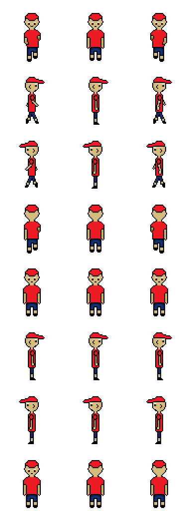
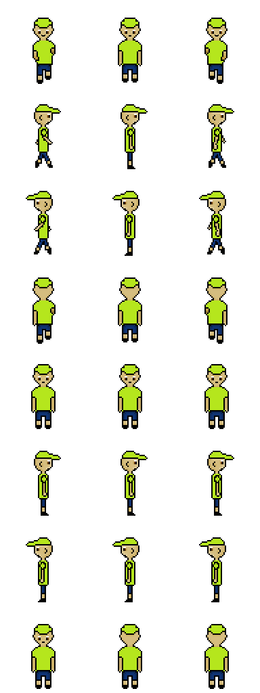

# Documentation<br>
 - Replaced the original player data objects:<br>
 - Removed player1_data object with properties for a red square (id, greeting, scale, position, color, hitbox, WASD keypress)<br>
 - Removed player2_data object with properties for a green square (id, greeting, scale, position, color, hitbox, arrow keypress)<br>
 - Implemented new Player class with physics-based movement:<br>
 - Added properties for vertical velocity, jump force, gravity, and jumping states<br>
 - Created update() method for handling gravity, jumping, and ground collision<br>
 - Added jump() method for initiating jumps when grounded<br>
 - Included example usage with spacebar jump control and game loop<br>
 - Enhanced player visuals:<br>
 - Added idle sprite animation for players<br>
 - Created a brand new sprite sheet for Player 1 and Player 2<br>


Code I did<br>


 ```
 


    const sprite_src_chillguy2 = path + "/images/gamify/chillguyv2.png"; //chill guy playere data
    const CHILLGUY2_SCALE_FACTOR = 5;
    const sprite_data_chillguy2 = {
        id: 'Chill Guy',
        greeting: "Hi, I am Chill Guy, the desert wanderer. I am looking for wisdom and adventure!",
        src: sprite_src_chillguy,
        SCALE_FACTOR: CHILLGUY_SCALE_FACTOR,
        STEP_FACTOR: 1000,
        ANIMATION_RATE: 50,
        INIT_POSITION: { x: 0, y: height - (height / CHILLGUY_SCALE_FACTOR) }, 
        pixels: { height: 1024, width: 384 }, // Adjusted to match the provided sprite sheet
        orientation: { rows: 8, columns: 3 }, // 8 total rows (4 movement + 4 stationary)

        // Movement animations (3-frame animations)
        down: { row: 0, start: 0, columns: 3 },
        left: { row: 2, start: 0, columns: 3 },
        right: { row: 1, start: 0, columns: 3 },
        up: { row: 3, start: 0, columns: 3 },

        // Stationary animations (Single-frame)
        downStationary: { row: 4, start: 1, columns: 1 },
        leftStationary: { row: 6, start: 1, columns: 1 },
        rightStationary: { row: 5, start: 1, columns: 1 },
        upStationary: { row: 7, start: 1, columns: 1 },

        // Hitbox (adjust for collision detection)
        hitbox: { widthPercentage: 0.45, heightPercentage: 0.2 },
        // Movement keys
        keypress: { up: 38, left: 37, down: 40, right: 39 }, // Arrow keys

        // Track active movement keys
        activeKeys: new Set(),

        // Handles key press (activates movement animation)
        handleKeyPress(event) {
            this.activeKeys.add(event.keyCode);
            this.updateAnimation();
        },

        // Handles key release (switches to stationary animation when no keys are held)
        handleKeyRelease(event) {
            this.activeKeys.delete(event.keyCode);
            this.updateAnimation();
        },

        // Updates animation based on active keys
        updateAnimation() {
            if (this.activeKeys.size === 0) {
                this.currentAnimation = this.downStationary; // Default to facing forward
            }
        }
    };


    const sprite_src_chillguy = path + "/images/gamify/chillguyv3.png"; //chill guy playere data
    const CHILLGUY_SCALE_FACTOR = 5;
    const sprite_data_chillguy = {
        id: 'Chill Guy',
        greeting: "Hi, I am Chill Guy, the desert wanderer. I am looking for wisdom and adventure!",
        src: sprite_src_chillguy,
        SCALE_FACTOR: CHILLGUY_SCALE_FACTOR,
        STEP_FACTOR: 1000,
        ANIMATION_RATE: 50,
        INIT_POSITION: { x: 0, y: height - (height / CHILLGUY_SCALE_FACTOR) }, 
        pixels: { height: 1024, width: 384 }, // Adjusted to match the provided sprite sheet
        orientation: { rows: 8, columns: 3 }, // 8 total rows (4 movement + 4 stationary)

        // Movement animations (3-frame animations)
        down: { row: 0, start: 0, columns: 3 },
        left: { row: 2, start: 0, columns: 3 },
        right: { row: 1, start: 0, columns: 3 },
        up: { row: 3, start: 0, columns: 3 },

        // Stationary animations (Single-frame)
        downStationary: { row: 4, start: 1, columns: 1 },
        leftStationary: { row: 6, start: 1, columns: 1 },
        rightStationary: { row: 5, start: 1, columns: 1 },
        upStationary: { row: 7, start: 1, columns: 1 },

        // Hitbox (adjust for collision detection)
        hitbox: { widthPercentage: 0.45, heightPercentage: 0.2 },
        // Movement keys
        keypress: { up: 87, left: 65, down: 83, right: 68 }, // W, A, S, D

        // Track active movement keys
        activeKeys: new Set(),

        // Handles key press (activates movement animation)
        handleKeyPress(event) {
            this.activeKeys.add(event.keyCode);
            this.updateAnimation();
        },

        // Handles key release (switches to stationary animation when no keys are held)
        handleKeyRelease(event) {
            this.activeKeys.delete(event.keyCode);
            this.updateAnimation();
        },

        // Updates animation based on active keys
        updateAnimation() {
            if (this.activeKeys.size === 0) {
                this.currentAnimation = this.downStationary; // Default to facing forward
            }
        }
    };
```

# Hack Three (Spritesheet part (NOT IMPLEMENTATION))


Ruhaan created this sprite sheet: <br>



Redesigned sprite sheet by me: <br>
